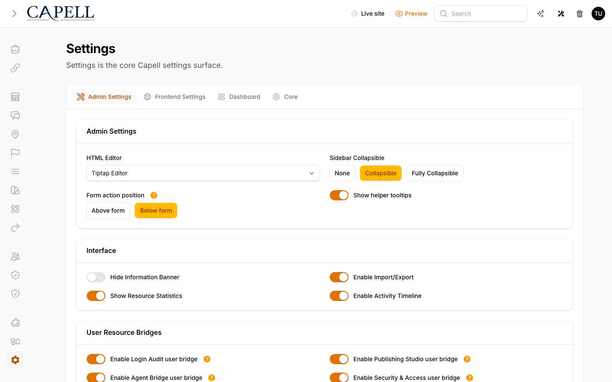
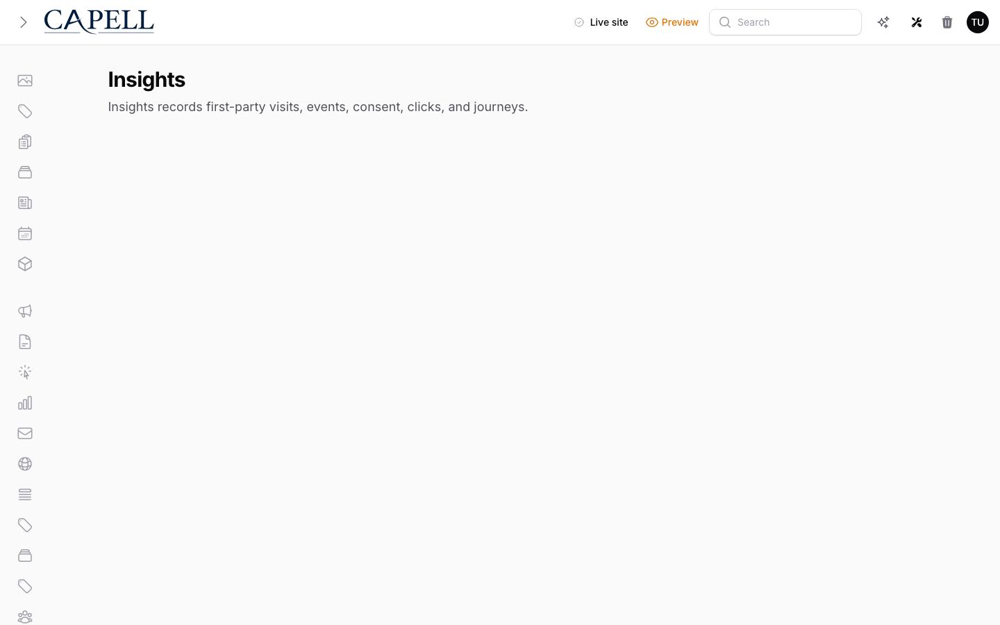
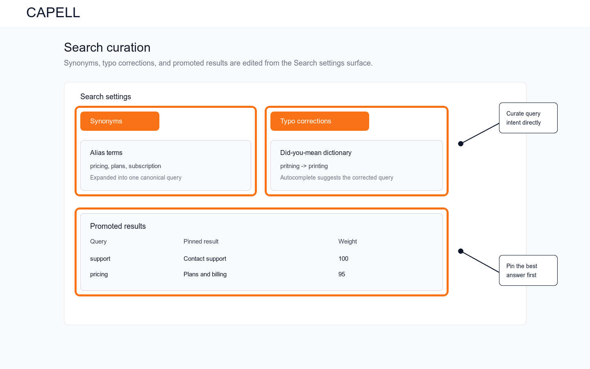

# Using Search

This guide is for editors who tune site search and owners deciding what should be searchable. Every step uses the labels you see on screen.

## Using Search (editor how-to)

### How to choose what is searchable

1. Go to **Search**.
2. In the settings, choose which content appears in site search.
3. Set how searches are logged, how long that history is kept, and how results behave.
4. Save. Visitors can now find that content from the search box.

### How to see what visitors search for

1. Open **Search activity**.
2. Review the most common searches, and the ones that returned nothing.
3. Use this to decide what content or synonyms to add.

The **Top searches** view shows your most searched terms.

The **Trending searches** view shows what is rising over your chosen time window.

### How to add a synonym

1. Go to **Synonyms**.
2. Add a **Query** and its equivalent words (for example "tee" and "T-shirt").
3. Save. Now either word finds the same results.

Search curation also lets you correct common typos and promote a chosen answer for a query.

### How to handle searches with no results

1. In **Search activity**, find searches that returned nothing.
2. Either add the missing content, or add a **synonym** that points to existing content.

## Rolling out Search (for owners)

### Turn on first

- **A sensible set of searchable content.** Make your key pages and products findable before fine-tuning.

### Add when needed

| Need                               | Enable                     |
| ---------------------------------- | -------------------------- |
| Different words for the same thing | **Synonyms**               |
| Understand visitor intent          | **Search activity** review |

### Don't enable yet

- Don't make everything searchable at once. Too much low-value content makes results noisy. Add as needed.

### Who does what

| Role       | First useful screen                            |
| ---------- | ---------------------------------------------- |
| Editor     | **Synonyms** and **Search activity**           |
| Site owner | **Search settings**: decide what is searchable |

## Troubleshooting for editors

| What you see                     | What it means                                         | What to do                                           |
| -------------------------------- | ----------------------------------------------------- | ---------------------------------------------------- |
| A search returns nothing         | The content isn't searchable, or uses different words | Make the content searchable, or add a **synonym**    |
| Results feel noisy or irrelevant | Too much low-value content is indexed                 | Narrow what is searchable in the settings            |
| A new page isn't found in search | It hasn't been indexed yet                            | Wait for indexing, or ask your developer to re-index |
