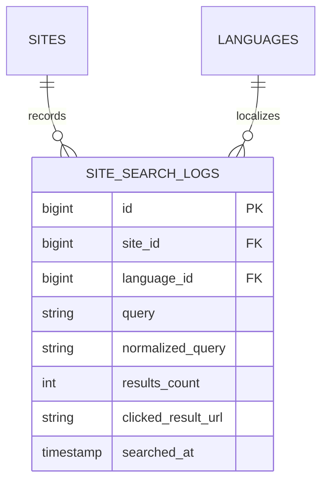

# Search

Status: **Available, schema-owning** · Kind: **package** · Tier: **premium** · Bundle: **search-seo** · Contexts: **admin, frontend, console** · Product group: **Capell Search & SEO**

This page is the consolidated implementation overview for the Search package. It is extracted from the package README, service providers, migrations, config files, routes, resources, models, actions, and the shared Capell ERD notes where available.

## What This Plugin Adds

Search adds a frontend search route, configurable search drivers, result click tracking, query logging, and admin search insights.

- Frontend search controller route.
- Database and Scout search drivers.
- Header search render hook.
- Search insights widgets.
- Settings schema and dashboard contributor.
- Actions for search, normalization, logging, click tracking, and purging logs.

## Developer Notes

Uses a Search contract and driver classes so search can start with database queries and move to Scout without changing the frontend surface.

- SearchServiceProvider and AdminServiceProvider register the package.
- Config file: capell-search.php.
- Route: GET search by default, named capell-frontend.search.
- Model: SearchLog.
- Drivers: DatabaseSearch and ScoutSearch.
- Command: PurgeSearchLogsCommand.

## Operational Notes

Lets visitors search site content and lets operators review what people searched for, including zero-result terms.

- Adds search_logs table and settings migration.
- Adds frontend search route.
- Adds optional header search render hook.
- Adds dashboard insights widgets.
- Adds config keys for driver, route, result count, excerpts, logging, hashing, and retention.

## Data And Retention

- search_logs stores site, language, query, normalized query, result count, clicked URL, and searched_at.
- Logs connect to sites and languages.
- Retention defaults to 180 days in config.

## Screenshot Plan

- Frontend search results page.
- Header search field.
- Top searches widget.
- Trending searches widget.
- Zero-result searches widget.
- Site search settings screen.

## Pitfalls

- Database driver config must point at searchable columns that exist.
- Minimum query length defaults to 2 characters.
- Disable logging or hashing according to privacy requirements.
- Run log purge if retention needs enforcement.

## Verification

- Run `vendor/bin/pest packages/search/tests` when package tests exist.
- Run the relevant host-app migration or package install flow in a disposable database.
- Open the listed admin or frontend surface and compare it with the screenshot plan.

## Package Manifest

- Composer name: `capell-app/search`
- Product group: Capell Search & SEO
- Kind: package
- Tier: premium
- Bundle: search-seo
- Contexts: `admin`, `frontend`, `console`
- Requires: `capell-app/core`, `capell-app/admin`, `capell-app/frontend`
- Optional dependencies: None listed.

## Admin Surfaces

- None proven in this package directory.

## Commands

- `search:purge {--days= : Override retention days}` (packages/search/src/Console/Commands/PurgeSearchLogsCommand.php)

## Routes And Config

- Config: packages/search/config/capell-search.php
- Route file: packages/search/routes/web.php

## Permissions And Gates

- Gate: SearchOverviewStatsWidget: `admin`, `super_admin`
- Gate: TopSearchesWidget: `admin`, `super_admin`
- Gate: TrendingSearchesWidget: `admin`, `super_admin`
- Gate: ZeroResultSearchesWidget: `admin`, `super_admin`

## Migrations

- Migration: create_search_logs_table.php
- Settings migration: add_search_settings.php

## ERD Excerpt

## Screenshot Automation

Deployment should read [screenshots.json](screenshots.json), install the package with demo data, resolve each admin surface or frontend URL, and write images to `public/docs/screenshots/packages/search`.

- Frontend search results page.
- Header search field.
- Top searches widget.
- Trending searches widget.
- Zero-result searches widget.
- Site search settings screen.
